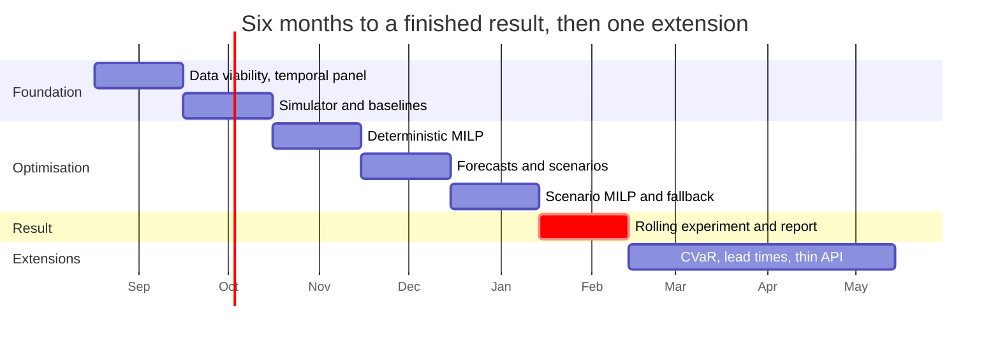

# Inventory Allocation Lab

> **Portfolio status · 2026-08-25: PAUSED, 0 active h/week.** The preregistered idea and
> complete git history are retained, but the project is outside the current Search/Ranking
> and Streaming/ML Data portfolio paths. It resumes only after a separate career decision.
> No model, optimiser, or empirical result was completed before the pause.

[](https://github.com/m4themagics/inventory-allocation-lab/actions/workflows/ci.yml)
[](pyproject.toml)
[](https://github.com/astral-sh/ruff)

Weekly inventory allocation over real retail sales, built one decision policy at a time
against a single closed-loop evaluation core — from a proportional heuristic to a
scenario-based stochastic MILP.

**The question this repository is built to answer:**

> Under which scarcity and forecast-uncertainty regimes does a **scenario-based allocation
> MILP** reduce out-of-sample operating cost enough to pay for its extra solve time over a
> point-forecast MILP?

Not “does a probabilistic forecast score better”. A point forecast collapses an asymmetric,
correlated demand distribution to its mean before the decision is made. When supply is loose,
that simplification may change nothing. When supply, store space or receiving capacity binds,
the same simplification can send the last case pack to the wrong store and turn a small
forecast error into shortage cost.

The M5 competition studies the accuracy and calibration of probabilistic retail forecasts but
stops before the downstream allocation decision. Recent scenario predict-then-optimise work
shows the value of demand scenarios in a richer inventory-routing problem, while a production
case from JD.com integrates forecasting, optimisation and simulation on proprietary data.
This repository does not propose a new stochastic-programming method. Its lane is the
practitioner’s map those papers do not give on a public, reproducible benchmark: **where the
stochastic solution pays, where a deterministic one is enough, and what the extra robustness
costs operationally**.

- [M5 uncertainty competition](https://doi.org/10.1016/j.ijforecast.2021.10.009)
- [Scenario Predict-then-Optimize for Data-Driven Online Inventory Routing](https://doi.org/10.1287/trsc.2024.0613)
- [JD.com inventory allocation in production](https://doi.org/10.1287/inte.2025.0245)

Everything before that map is scaffolding for being able to trust it: if the temporal split
leaks, scenarios destroy cross-store dependence, the MILP is wrong, or policies are compared
from different states, the final cost delta is worth nothing.

```mermaid
flowchart LR
    H["Weekly demand history<br/>strictly before decision t"]

    subgraph FC ["Forecasting"]
        direction TB
        N["Seasonal naive"]
        L["LightGBM point forecast"]
        Q["Joint demand scenarios"]
    end

    subgraph DP ["Allocation policies"]
        direction TB
        P["Proportional"]
        G["Feasible greedy"]
        D["Deterministic MILP"]
        S["Scenario MILP"]
    end

    EV["One closed-loop evaluation core<br/>same demand · policy-specific state"]
    R["Reported number<br/>paired interval · seed · fingerprint · solver status"]

    H --> FC --> DP --> EV --> R
```



Forecast quality and decision quality are scored separately, so a better WAPE cannot hide a
worse allocation. Every policy carries its own remaining inventory forward, so one policy is
never evaluated from the state created by another.

## Status

**Paused at Week 0 — dataset and decision-problem viability.** Pass criteria are drafted; the dataset
slice and operational rules still need to be preregistered. No loader, model or optimiser
yet. The full schedule is in the [development plan](docs/development-plan.md).

| Month | Content | State |
|---|---|---|
| 1 | Weekly panel, temporal contract, fingerprints | not started |
| 2 | Simulator, metrics, proportional and greedy baselines | not started |
| 3 | Deterministic MILP, brute-force parity, solver diagnostics | not started |
| 4 | Seasonal naive, LightGBM, calibrated joint scenarios | not started |
| 5 | Scenario MILP, fallback and batch decision contract | not started |
| 6 | **Scarcity × uncertainty map** and the write-up | not started |

Every month adds one layer, but the previous version must already be finished work. The
central question is answered at month six; CVaR, lead times and a thin API are extensions on
top, not prerequisites for the result.



The critical bar is the rolling decision experiment. Production plumbing stops at the level
needed to make that experiment honest: one batch contract, explicit solver telemetry and a
fallback whose feasibility is tested independently.

## Results

Empty until the rolling evaluation core and MILP correctness tests are in place. Every cost
delta will carry a paired moving-block bootstrap interval resampled **by week**, and no number
enters this table before the [research protocol](docs/research-protocol.md) passes.

| Policy | Forecast WAPE | Realised cost | Fill rate | Oracle regret | Solve p95 | Fallback rate |
|---|---:|---:|---:|---:|---:|---:|
| Proportional allocation | — | — | — | — | n/a | n/a |
| Feasible greedy | — | — | — | — | n/a | n/a |
| Seasonal naive + deterministic MILP | — | — | — | — | — | — |
| LightGBM + deterministic MILP | — | — | — | — | — | — |
| Safety-stock MILP | — | — | — | — | — | — |
| Scenario MILP | — | — | — | — | — | — |

The oracle solves the same one-week problem using realised demand from the exact
pre-decision state of the policy being evaluated. It is an evaluation bound, never a
deployable row. Solver time, status and fallback rate stay beside business cost because a
policy that wins only when allowed to solve indefinitely is a different operational object.

## Data

**Candidate, not yet committed to:**
[M5 Forecasting dataset](https://doi.org/10.5281/zenodo.10203108) — real Walmart unit sales,
calendar events and weekly sell prices across a product/store hierarchy.

Retail demand with prices and repeated store-level decisions makes M5 the most promising
public source, but suitability for this allocation problem is a hypothesis, not a property of
the dataset. Before any full loader or model is written,
[experiment 00](experiments/00_dataset_viability/README.md) tests temporal coverage,
intermittency, price completeness and whether train-derived scarcity regimes create genuinely
different constraint states. If the decision problem cannot be constructed honestly, the
dataset is rejected rather than the question quietly weakened.

The honest limitation, stated here and in every future report: M5 contains **sales, not
uncensored demand**, and publishes no source inventory, case packs, store capacity or shortage
cost. The operational layer is therefore semi-synthetic, derived from the training window and
versioned in configuration. Historical stockouts and substitution cannot be recovered and no
claim will pretend otherwise.

Raw data is never committed. `data/` will hold ingestion code, schema contracts and dataset
fingerprints only.

## Reproduce

The scaffold currently exposes only its own checks:

```bash
make install                       # uv sync --extra dev
make check                         # ruff + scaffold tests
```

Later phases add `make data`, `make profile`, `make backtest` and `make report`. Every result
will be reproducible by one command recorded beside it, with its seed, data fingerprint,
config snapshot and solver version.

## How this repository is meant to be read

- **One rolling protocol, one evaluation core.** Every policy sees the same exogenous demand
  and inbound supply, so its cost delta means something.
- **Forecast and decision metrics are separate.** WAPE says whether demand was predicted;
  regret says whether the scarce resource went to the right place.
- **The optimiser is checked, not trusted.** A hand-solvable instance, brute-force parity and
  an independent feasibility checker come before any finding.
- **Closed-loop state is part of the policy.** Remaining inventory follows the policy that
  created it; it is never reset each week to make comparisons convenient.
- **Negative results are kept.** If a safety-stock heuristic captures the stochastic gain at
  a fraction of the solve time, that is the result, not a failed project.

## Layout

```text
src/ial/
  contracts.py       state, forecast, plan and solver-telemetry contracts
  data/              M5 loading, weekly aggregation, temporal split
  forecasting/       seasonal naive, LightGBM, joint residual scenarios
  optimisation/      formulation, HiGHS adapter, oracle, feasible fallback
  simulation/        inventory transition and realised cost accounting
  evaluation/        rolling backtest, regret, intervals, diagnostics
configs/              experiment and operational-layer assumptions
experiments/          one directory per research question
reports/              results and figures
tests/fixtures/       tiny hand-solvable allocation instances
docs/                  plan, protocol, optimisation learning track
```

The layout is planned; core modules appear only when their phase begins.

## Documents

- [Development plan](docs/development-plan.md) — six months to a result, then extensions.
- [Research protocol](docs/research-protocol.md) — the rules a result must satisfy before it
  is reported.
- [Optimisation learning track](docs/learning-tracks/optimisation.md) — the ladder the MILP
  phases rest on.
- [Learning contract](LEARNING.md) — how this codebase will be authored and how AI assistance
  may and may not be used.
